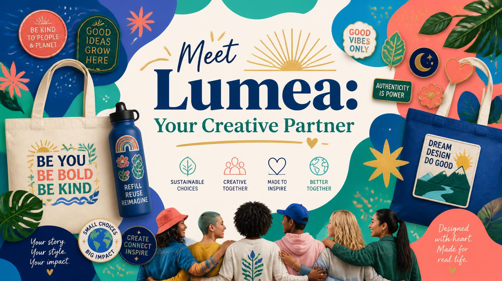
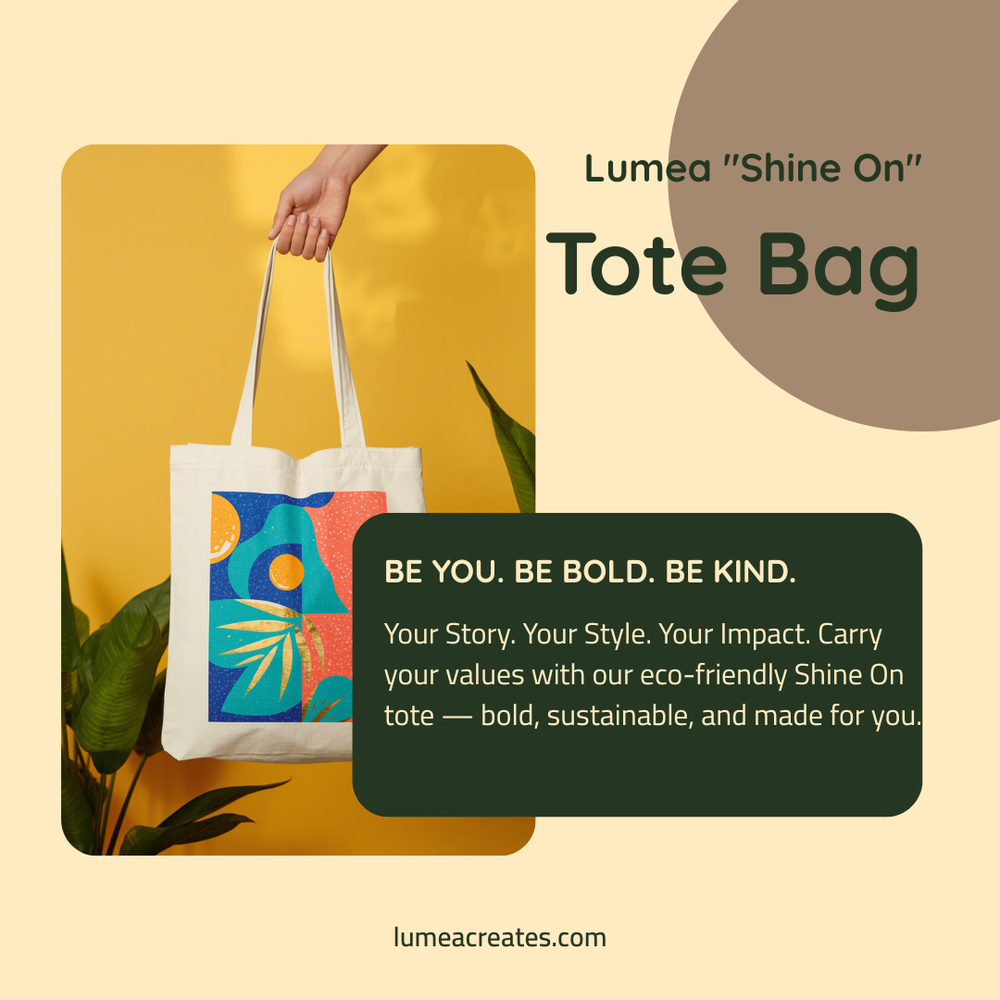
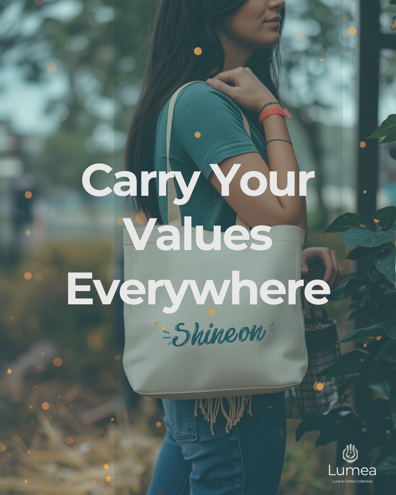
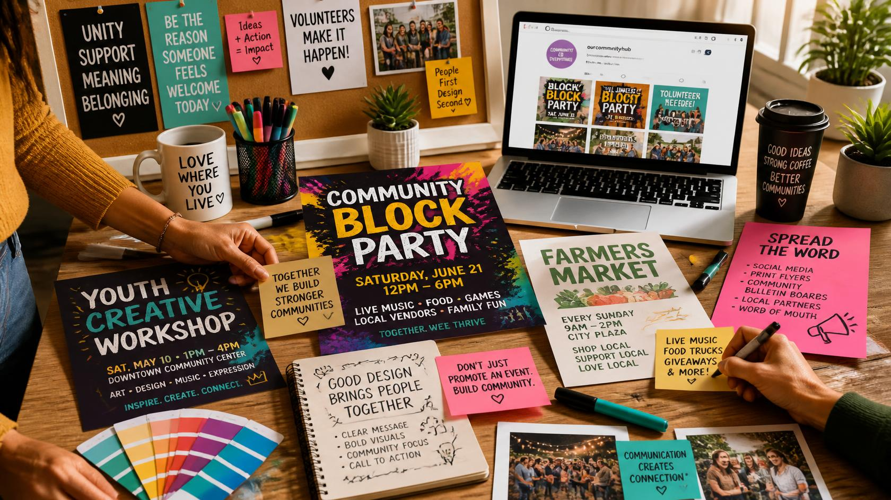

# Lumea: A Branding & Design Case Study

*Forage Academy Sponsored Content — Branding & Design Job Simulation*

## The Brief

The challenge: build a lifestyle brand from the ground up — one with a clear identity, a product people would actually want to carry, and a launch strategy to get it in front of the right community. The result was **Lumea**, a creative-partner brand built around sustainability, self-expression, and community.

## Finding the Brand's Voice

Every brand decision starts with understanding who it's for and why it matters to them. I anchored Lumea around four core values — Sustainable Choices, Creative Together, Made to Inspire, Better Together — and built the visual identity to match: warm blues, lush greens, coral and gold, playful shapes that feel handmade rather than mass-produced.

*The brand introduction: "Meet Lumea, Your Creative Partner" — establishing tone, palette, and the emotional promise ("designed with heart, made for real life") before a single product enters the picture.*

## Designing the Product Concept

With positioning in place, I designed a customizable product concept: the Lumea "Shine On" Tote Bag — an eco-friendly canvas tote meant to double as a small piece of self-expression, not just a shopping bag.

*The "Shine On" tote — bold, sustainable, and built around the line "Be You. Be Bold. Be Kind," turning the product itself into a carrier of the brand's values.*

## Bringing the Product Into Real Life

A product concept only means something once you can picture it in someone's actual day. I built out lifestyle marketing collateral showing the tote in a real, lived-in setting — a farmer's market — to ground the brand in everyday moments rather than a studio shoot.

*"Carry Your Values Everywhere" — the tote in context, reinforcing that Lumea is meant for real life, not just a shelf.*

## Planning the Community Launch

A brand doesn't launch in a vacuum — it launches into a community that's already talking. I planned a set of community-first events (a Youth Creative Workshop, a Community Block Party, and support for the local Farmers Market) and mapped out the promotion strategy behind them: social media, print flyers, community bulletin boards, local partnerships, and word of mouth.

*Event concepts and campaign planning — working from the belief that "good design brings people together," not just attention.*

## The Reflection

Working through this simulation is what sent me down a small rabbit hole into branding strategy more broadly — which turned into its own [Click here to read the full Blog Case Study](https://github.com/nupurpramod/lumea-branding-design-simulation/blob/main/blog-brand-inspiration.html) about why I can't stop thinking about how brands earn trust before they've said a word. Building Lumea from values → product → real-world context → community launch made that process concrete: a brand isn't a logo, it's a series of decisions about who you're for and why that should matter to them.

---

**Skills applied:** Brand Strategy · Product Design · Marketing Collateral · Community Event Planning · Social Campaign Strategy
**Simulation:** [Forage Academy Sponsored Content](https://www.theforage.com/) — Branding & Design Job Simulation
